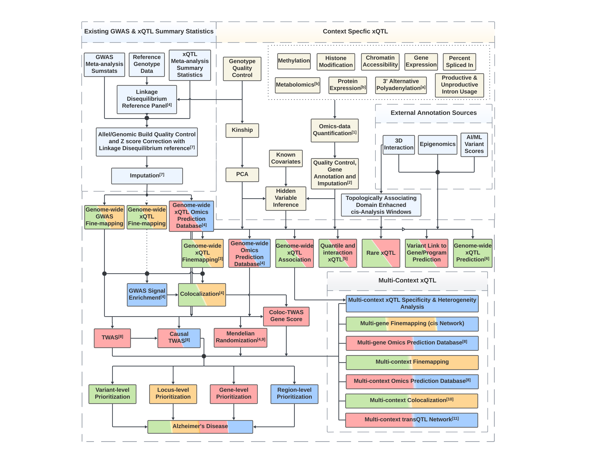

# FunGen-xQTL Computational Protocol

Developed for reproducible & reusable molecular QTL analyses for the NIH/NIA Alzheimer's Disease Sequencing Project (ADSP) Functional Genomics xQTL (FunGen-xQTL) Project.

## Overview of the protocol

### Standardized reference data

Reference data are standardized and curated by the ADSP FGC Standardization Workgroup in coordination with [NIAGCADS](https://www.nia.nih.gov/research/ad-genetics). Please find reference data specifications on [ADSP Dashboard](https://www.niagads.org/adsp/content/adspgcadgenomeresources-v2pdf).

### Software environment

We use a set of packages from the Conda ecosystem to deploy our software.  Most packages are from [conda-forge](https://conda-forge.org) and [bioconda](https://bioconda.github.io), along with a [custom channel](https://anaconda.org/dnachun) for software unavailable from those repositories.

### Pipeline execution

Pipelines in this repository are written in the [Script of Scripts (SoS) workflow language](https://vatlab.github.io/sos-docs/). Like most other workflow languages, SoS workflows can **distribute and execute computing jobs directly in High Performance Computing cluster**. Unlike most other workflow languages, SoS workflows are created using SoS Notebooks (based on Ipython Notebook and developed in [Jupyter](https://jupyter.org/)) which allow for both **scientific narrative and pipeline scripts in the same document**. Unlike typical Jupyter Notebooks intended for interactive data analysis, SoS workflows written in Jupyter Notebooks can be executed directly as command line scripts either on a local computer or in a HPC environment. 

We provide this [toy example for running SoS pipeline on a typical HPC cluster environment](https://github.com/statfungen/xqtl-protocol/blob/main/code/misc/Job_Example.ipynb). First time users are encouraged to try it out in order to help setting up the computational environment necessary to run the analysis in this protocol.

### Source code

- Source code of pipelines implemented in this repository are available at https://github.com/statfungen/xqtl-protocol/tree/main/code. 

## How to use the resource

### Organization of the resource

The website https://statfungen.github.io/xqtl-protocol is generated from files under the `code` folder of the source code repository. The `pipeline` folder contains symbolic links automatically generated for pipeline files under `code.` The logic of the entire xQTL analysis workflow is roughly reflected on the **left sidebar**:

- The **GETTING STARTED**  section serves as the main landing page or index of the xQTL protocol, guiding users through the various pipelines implemented in this repository. It's structured to mirror the logic of the xQTL analysis we've crafted. Because this page provides pointers to other sections, users can primarily focus here without having to sift through the rest of the pages pages in this repository.
- The **COMMAND GENERATOR** section is designed as a one-stop hub for "push button" commands, enabling users to generate the full QTL analysis pipeline workflow scripts from a straightforward configuration file. Notebooks within this section are intended to be **executed as command line software** for data analysis command generation. Users can then execute these generated commands directly to conduct all preset analyses. Alternatively, they can tweak the commands to cater to particular analysis requirements. The configuration file serves a dual purpose: streamlining control and maintaining a record of executed workflows.
- Other sections in bold fonts provide an array of available analyses, presented roughly from upstream to downstream processes. Most of these sections feature ***mini-protocols***, represented as clickable, non-bold text under each analysis category, leading to specific notebooks. These notebooks detail the commands necessary for the analyses defined in the respective mini-protocols. Predominantly tutorial-based, they are designed to be **executed interactively in Jupyter or via the command terminal**, allowing users to navigate through the SoS pipelines step by step. A few of these sections serve as actual ***pipeline modules*** which we'll discuss next (see below).
- *Mini-protocols*, as mentioned earlier, can be expanded by clicking the downward arrows, revealing the SoS implementations of ***pipeline modules***. These represent the crux of the pipeline implementations and are intended to be **executed as command line software**. They're also **self-contained**, allowing for reusability beyond the specific context of xQTL data analysis.

### Computing environment setup

- In order to run the xQTL protocol on your computer (or a High Performance Computing cluster), please see our pixi setup repository at [https://github.com/StatFunGen/pixi-setup](https://github.com/StatFunGen/pixi-setup) for instructions to install software. Native support is only provided for Linux and macOS (Intel and Apple Silicon) - Windows users will need to install Windows Subsystem For Linux (WSL) to locally install the software.
- We have provided example data-sets in [this Synapse folder](https://www.synapse.org/#!Synapse:syn36416559/files/). For guidance on downloading the data programmatically, refer to [this documentation](https://help.synapse.org/docs/Upload-and-Download-Data-in-Bulk.2003796248.html). If you need to set up a Synapse client, once you have installed, `pixi`, use `pixi global install -c biconda -c conda-forge synapseclient`.
  - Within the `test_data` folder, datasets prefixed with **MWE** (Minimal Working Example) are provided. These are used for unit testing each module, ensuring the integrity of the code.
  - The `protocol_data` folder houses a comprehensive set of data, illustrating the full extent of our protocol. This is showcased in [this notebook](https://statfungen.github.io/xqtl-protocol/code/xqtl_protocol_demo.html), with the [source code](https://github.com/statfungen/xqtl-protocol/blob/main/code/xqtl_protocol_demo.ipynb) available for reference.
- Please clone this repository https://github.com/statfungen/xqtl-protocol onto your computer. This is the source code for this resource. All pipelines are symbolic links in the `pipeline` folder. Users are encouraged to execute from the root of the repository folders by typing `sos run pipeline/<pipeline_file>.ipynb`
that is, executing the symbolic links directly to perform the analysis.

### See Also

- Analysis from FunGen-xQTL consortium using this protocol can be found at https://github.com/statfungen/fungen-xqtl-analysis

## Our team

This repository is developed by the Analysis Working Group of the NIA FunGen-xQTL consortium.

### Developers

**Lead developers**

- Hao Sun, Department of Neurology, Columbia University
- Gao Wang, Department of Neurology, Columbia University

**Main contributors** (largely based on GitHub Pull Requests)

| Name             | Affiliation                                                       |
|------------------|-------------------------------------------------------------------|
| Xuanhe Chen      | Department of Biostatistics, Columbia University                  |
| Wenhao Gou       | Department of Biostatistics, Columbia University                  |
| Liucheng Shi     | Department of Biostatistics, Columbia University                  |
| Haochen Sun      | Department of Biostatistics, Columbia University                  |
| Zining Qi        | Department of Biostatistics, Columbia University                  |
| Yifei Wang       | Department of Neurology, Columbia University                      |
| Ru Feng          | Department of Neurology, Columbia University                      |
| Alexandre Pelletier| Department of Medicine, Boston University                        |
| Travyse Edwards  | Mount Sinai & University of Pennsylvania                           |
| Daniel Nachun    | Department of Pathology, Stanford University                      |
| Jiacheng Li      | Department of Neurology, Columbia University                      |
| Mintao Lin       | Department of Medicine, Boston University                         |

### Leadership

**FunGen-AD**

| Name             | Affiliation                                                       |
|------------------|-------------------------------------------------------------------|
| Philip De Jager  | Department of Neurology, Columbia University                      |
| Carlos Crunchaga | Department of Psychiatry, Neurology and Genetics, Washington University in St. Louis|

**FunGen-xQTL Analysis Working Group**

| Name             | Affiliation                                                       |
|------------------|-------------------------------------------------------------------|
| Gao Wang         | Department of Neurology, Columbia University                      |
| Xiaoling Zhang   | Departments of Medicine and Biostatistics, Boston University      |
| Edoardo Marcora  | Departments of Neuroscience, Genetics and Genomic Sciences, Icahn School of Medicine at Mount Sinai |
| Fanny Leung      | Department of the Pathology and Laboratory Medicine, University of Pennsylvania |
| Julia TCW        | Department of Pharmacology and Bioinformatics, Boston University                         |
| Kushal K. Dey    | Memorial Sloan Kettering                                          |
| Alan Renton      | Departments of Neuroscience, Genetics and Genomic Sciences, Icahn School of Medicine at Mount Sinai |
| Stephen Montgomery | Department of Pathology, Stanford University                    |
| Xiaoquan Wen     | Department of Biostatistics, University of Michigan               |

