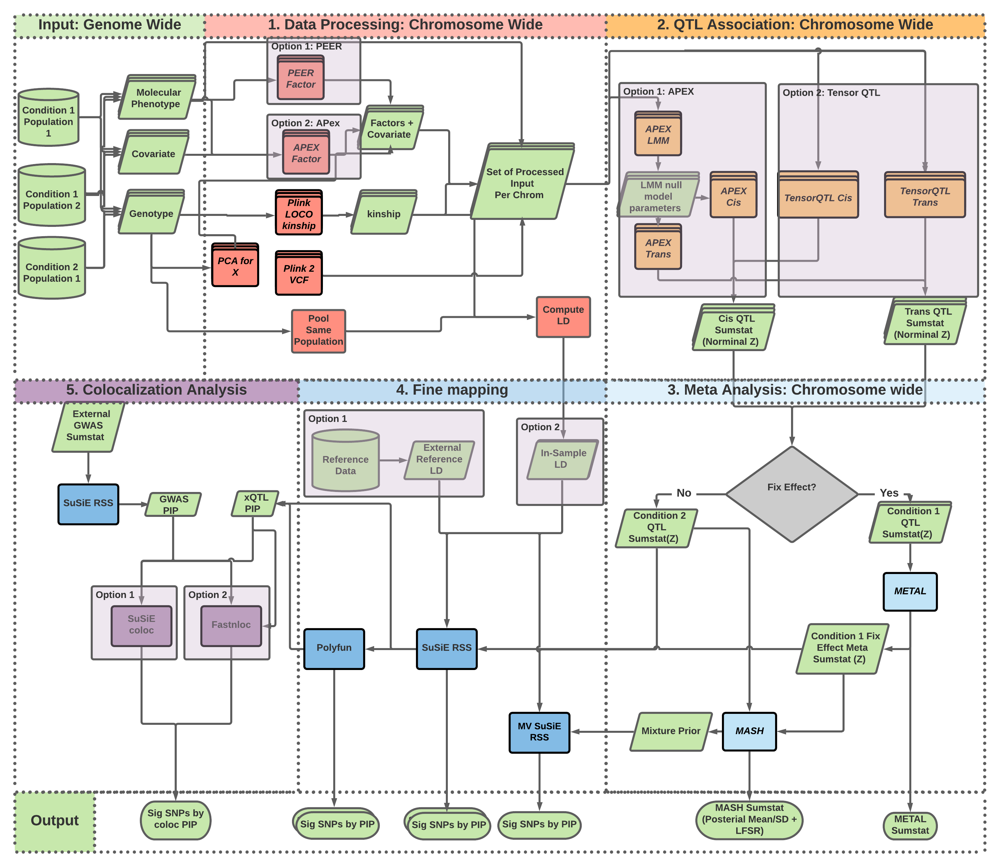

# xQTL analysis pipeline

Developed for reproducible QTL analysis for the NIH/NIA Alzheimer's Disease Sequencing Project Functional Genomics Consortium.

## How to use this resource

### Pipeline execution

Pipelines in this repository are written in the [Script of Scripts (SoS) workflow language](https://vatlab.github.io/sos-docs/). Like most other workflow languages, SoS workflows can **distribute and execute computing jobs directly in High Performance Computing cluster**. It can also use **containers (Docker or Singularity)** to help with setting up computational environment and improve reproducibility. Unlike most other workflow languages, SoS workflows are created using SoS Notebooks (based on Ipython Notebook and developed in [Jupyter](https://jupyter.org/)) which allow for both **scientific narrative and pipeline scripts in the same document**. Unlike typical Jupyter Notebooks intended for interactive data analysis, SoS workflows written in Jupyter Notebooks can be executed directly as command line scripts either on a local computer or in a HPC environment. 

We provide this [toy example for running SoS pipeline on a typical HPC cluster environment](https://github.com/cumc/xqtl-pipeline/blob/main/pipeline/misc/Job_Example.ipynb). First time users are encouraged to try it out in order to help setting up the computational environment necessary to run the QTL analysis.

### Source code

- Source code of pipelines and containers implemented in this repository are available at https://github.com/cumc/xqtl-pipeline/tree/main/pipeline. 
- Container configurations are available at https://github.com/cumc/xqtl-pipeline/tree/main/container

### Organization of the resource

The website https://cumc.github.io/xqtl-pipeline is generated from files under `pipeline` folder of the source code repository. The logic of the entire xQTL analysis workflow is roughly reflected on the left side bar:

- The **COMPLETE PIPELINES** section is reserved for "push botton" commands that generates the entire QTL analysis pipeline workflow script from a single configuration file (**[FIXME: link to config file example]**). Notebooks under this sections are meant to be **executed as command line software** to generate data analysis commands. The generated commands can be executed as is to complete all available analysis, or can be used to help customizing specific analysis tasks by making modification on them. The configuration file itself helps centralized control and book keeping of workflows executed.
- Other sections in bold contain various types of analysis available, roughly showing in order from upstream to downstream analysis. We will refer to them as ***analysis groups***, which are further divided into ***analysis subgroups*** by various non-bold, clickable text under each analysis group linking to some notebooks. These notebooks illustrate commands to perform analysis implemented in the subgroup. Most of them are "tutorials" in nature and are meant to be **executed interactively in Jupyter or in command terminal** to run the SoS pipelines line by line. A few are the actual ***pipeline modules*** implementing pipelines in SoS, as will be discussed next.
- *Analysis subgroups* can be expanded by clicking on the down arrows to access the SoS workflows implemention of ***pipeline modules***. These are the core pipeline implementations to be **executed as command line software**, and are meant to be **self-contained** --- they may be used in other contexts not specific to the xQTL data analysis. Each of these pipeline modules are documented with some background information, required input, expected output, and most importantly a **minimal working example** to allow users to test it out with a toy data-set before applying to their own analysis. The rest of the pipeline module are the actual code implementations.

## xQTL workflow blueprint

## Contributors

This repository is developed by the ADSP FG Brain xQTL consortium.

### Developers

Lead developers

- Hao Sun, Department of Neurology, Columbia University
- Wenhao Gou, Department of Biostatistics, Columbia University
- Amanda Tsai, Department of Biostatistics, Columbia University  
- Gao Wang, Department of Neurology, Columbia University

Project leader

- Philip De Jager, Department of Neurology, Columbia University

Brain xQTL methods and analysis subgroup

- Gao Wang (group leader), Department of Neurology, Columbia University
- Edoardo Marcora, Departments of Neuroscience, Genetics and Genomic Sciences, Icahn School of Medicine at Mount Sinai
- Xiaoling Zhang, Departments of Medicine and Biostatistics, Boston University
