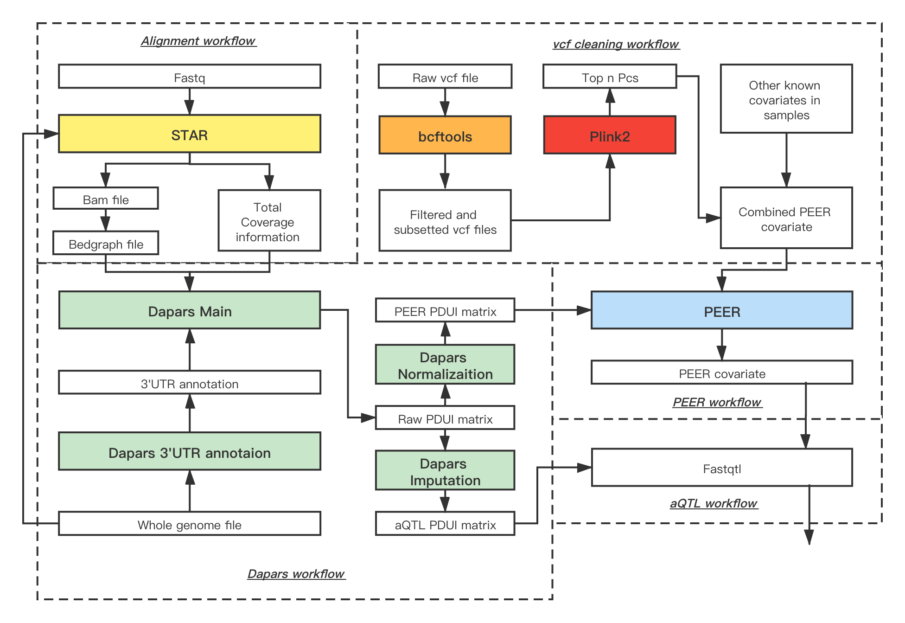

# xQTL analysis pipeline

Developed for reproducible QTL analysis for the NIH/NIA Alzheimer's Disease Sequencing Project Functional Genomics Consortium

https://cumc.github.io/xqtl-pipeline

## How to use this resource

The left sidebar lists the analysis to be performed for QTL analysis, roughly in sequential orders.

- The **COMPLETE PIPELINES** section is reserved for publishing the code used for various QTL analysis. Contents in this section can be generated automatically from workflow notebooks in the other sections, as will be discussed next.
- The rest sections in bold are various types of analysis available, from generating the molecular phenotypes to performing some of the selected multi-omics data integration analysis.
- Text under each bold section title shows the complete workflow commands to perform analysis implemented using the Script of Scripts (SoS) language.
- 

## Overall xQTL workflow schema

## Molecular phenotype specific pipelines

## Contributors

This repository is developed by the ADSP FG Brain xQTL consortium.

### Lead developers

Brain xQTL methods and analysis subgroup

- Gao Wang (PI), Department of Neurology, Columbia University
- Hao Sun, Department of Neurology, Columbia University
- Wenhao Gou, Department of Biostatistics, Columbia University
- Amanda Tsai, Department of Biostatistics, Columbia University  
- Xiaoling Zhang, Departments of Medicine and Biostatistics, Boston University

### Consortium collaborators

Single-cell nucleotide RNA-seq

- 

- 
